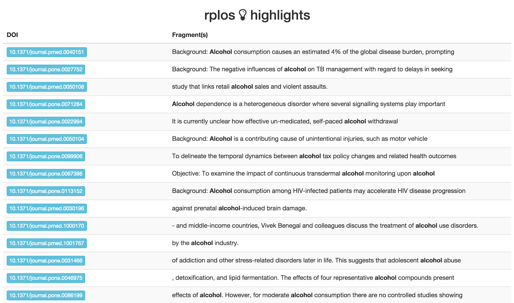

<!--
%\VignetteEngine{knitr::knitr}
%\VignetteIndexEntry{Faceted and highlighted searches}
%\VignetteEncoding{UTF-8}
-->

Faceted and highlighted searches
=====


In addition to `searchplos()` and related searching functions, there are a few slightly different ways to search: faceting and highlighted searches. Faceting allows you to ask, e.g., how many articles are published in each of the PLOS journals. Highlighting allows you to ask, e.g., highlight terms that I search for in the text results given back, which can make downstream processing easier, and help visualize search results (see `highbrow()` below). 

### Load package from CRAN


```r
install.packages("rplos")
```


```r
library('rplos')
```

### Faceted search

Facet by journal


```r
facetplos(q='*:*', facet.field='journal')
```

```
#> $facet_queries
#> NULL
#> 
#> $facet_fields
#> $facet_fields$journal
#>                                  X1      X2
#> 1                          plos one 1083485
#> 2                     plos genetics   45073
#> 3                    plos pathogens   39357
#> 4        plos computational biology   32816
#> 5  plos neglected tropical diseases   29607
#> 6                      plos biology   27463
#> 7                     plos medicine   19179
#> 8              plos clinical trials     521
#> 9                  plos collections      15
#> 10                     plos medicin       9
#> 
#> 
#> $facet_dates
#> NULL
#> 
#> $facet_ranges
#> NULL
```

Using `facet.query` to get counts


```r
facetplos(q='*:*', facet.field='journal', facet.query='cell,bird')
```

```
#> $facet_queries
#>        term value
#> 1 cell,bird    21
#> 
#> $facet_fields
#> $facet_fields$journal
#>                                  X1      X2
#> 1                          plos one 1083485
#> 2                     plos genetics   45073
#> 3                    plos pathogens   39357
#> 4        plos computational biology   32816
#> 5  plos neglected tropical diseases   29607
#> 6                      plos biology   27463
#> 7                     plos medicine   19179
#> 8              plos clinical trials     521
#> 9                  plos collections      15
#> 10                     plos medicin       9
#> 
#> 
#> $facet_dates
#> NULL
#> 
#> $facet_ranges
#> NULL
```

Date faceting


```r
facetplos(q='*:*', url=url, facet.date='publication_date',
  facet.date.start='NOW/DAY-5DAYS', facet.date.end='NOW', facet.date.gap='+1DAY')
```

```
#> $facet_queries
#> NULL
#> 
#> $facet_fields
#> NULL
#> 
#> $facet_dates
#> $facet_dates$publication_date
#>                   date value
#> 1 2015-06-26T00:00:00Z  1918
#> 2 2015-06-27T00:00:00Z     0
#> 3 2015-06-28T00:00:00Z  1814
#> 4 2015-06-29T00:00:00Z  2573
#> 5 2015-06-30T00:00:00Z   759
#> 6 2015-07-01T00:00:00Z     0
#> 
#> 
#> $facet_ranges
#> NULL
```

### Highlighted search

Search for the term _alcohol_ in the abstracts of articles, return only 10 results


```r
highplos(q='alcohol', hl.fl = 'abstract', rows=2)
```

```
#> $`10.1371/journal.pmed.0040151`
#> $`10.1371/journal.pmed.0040151`$abstract
#> [1] "Background: <em>Alcohol</em> consumption causes an estimated 4% of the global disease burden, prompting"
#> 
#> 
#> $`10.1371/journal.pone.0027752`
#> $`10.1371/journal.pone.0027752`$abstract
#> [1] "Background: The negative influences of <em>alcohol</em> on TB management with regard to delays in seeking"
```

Search for the term _alcohol_ in the abstracts of articles, and return fragment size of 20 characters, return only 5 results


```r
highplos(q='alcohol', hl.fl='abstract', hl.fragsize=20, rows=2)
```

```
#> $`10.1371/journal.pmed.0040151`
#> $`10.1371/journal.pmed.0040151`$abstract
#> [1] "Background: <em>Alcohol</em>"
#> 
#> 
#> $`10.1371/journal.pone.0027752`
#> $`10.1371/journal.pone.0027752`$abstract
#> [1] " of <em>alcohol</em> on TB management"
```

Search for the term _experiment_ across all sections of an article, return id (DOI) and title fl only, search in full articles only (via `fq='doc_type:full'`), and return only 10 results


```r
highplos(q='everything:"experiment"', fl='id,title', fq='doc_type:full',
   rows=2)
```

```
#> $`10.1371/journal.pone.0039681`
#> $`10.1371/journal.pone.0039681`$everything
#> [1] " Selection of Transcriptomics <em>Experiments</em> Improves Guilt-by-Association Analyses Transcriptomics <em>Experiment</em>"
#> 
#> 
#> $`10.1371/annotation/9b8741e2-0f5f-49f9-9eaa-1b0cb9b8d25f`
#> $`10.1371/annotation/9b8741e2-0f5f-49f9-9eaa-1b0cb9b8d25f`$everything
#> [1] " in the labels under the bars. The labels should read <em>Experiment</em> 3 / <em>Experiment</em> 4 instead of <em>Experiment</em>"
```

### Visualize highligted searches

Browse highlighted fragments in your default browser

This first examle, we only looko at 10 results


```r
out <- highplos(q='alcohol', hl.fl = 'abstract', rows=10)
highbrow(out)
```


But it works quickly with lots of results too


```r
out <- highplos(q='alcohol', hl.fl = 'abstract', rows=1200)
highbrow(out)
```


